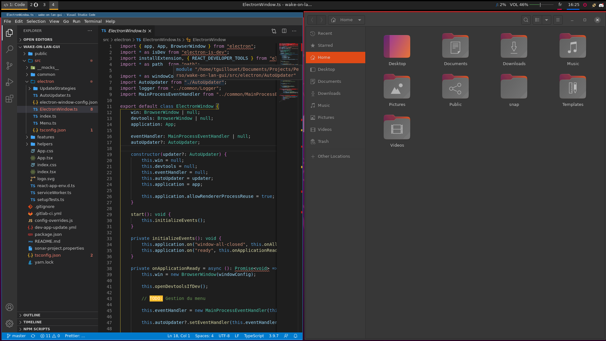

# Environnement de bureau

## Screenshots



## Installation

### **i3wm-gaps**
```bash
# Ajout du PPA
sudo add-apt-repository ppa:kgilmer/speed-ricer
sudo apt-get update

# Installation du fork d'I3Wm
sudo apt install i3wm-gaps

# Ecriture de la config dans le fichier ~/.config/i3/config
cat ./configs/i3/config > ~/.config/i3/config
```

Verifiez si le fichier `i3.desktop` existe dans le dossier `/usr/share/xsessions/`

Si il n'existe pas, exécutez cette commande
```bash
cp ./config/i3wm/i3.desktop /usr/share/xsessions/
```

Modifiez le fichier i3/config en fonction de votre configuration vidéo. Pour connaitre le nom de vos sorties vidéos, exécutez `xrandr`. Cet outil vous permet aussi de changer la disposition de vos écrans.

### **Rofi**
```bash
sudo apt install rofi

# Installation du theme slate
cp ./configs/rofi/slate.rasi /usr/share/rofi/themes

# Ecriture de la config dans le fichier ~/.config/rofi/config
cat ./configs/rofi/config > ~/.config/rofi/config
```

### **Polybar**
```bash
sudo apt install fonts-font-awesome

# Ecriture de la config dans le fichier ~/.config/i3/config
cat ./configs/polybar/config > ~/.config/polybar/config
```

### **LightDM**
```bash
# Installation de lightdm
sudo apt install lightdm
```

Une fois installé, lightdm devrait vous demander quel display manager vous souhaitez utiliser, sélectionnez **lightdm**.

Si aucun menu n'apparait, exécutez
```bash
sudo dpkg-reconfigure lightdm
```

Pour modifier l'environnement de bureau par défaut, vous devrez changer la valeur de `user-session` en `i3` dans le fichier `/usr/share/lightdm/lightdm.conf.d`
```ini
[SeatDefaults]
user-session=i3
```

### **LightDM GTK+ Greeter**
```bash
# Ajout du PPA
sudo add-apt-repository ppa:kalgasnik/ppa
sudo apt-get update

# Installation
sudo apt-get install lightdm-gtk-greeter-settings
```

**Configuration**

**Onglet Appearance** \
Theme: Yaru-dark \
Icons: Yaru 


### **LXAppearance**
```bash
sudo apt install lxappearance
```

**Configuration**

Widgets: Yaru-dark \
Icon Theme: Yaru \
Mouse Cursor: Yaru